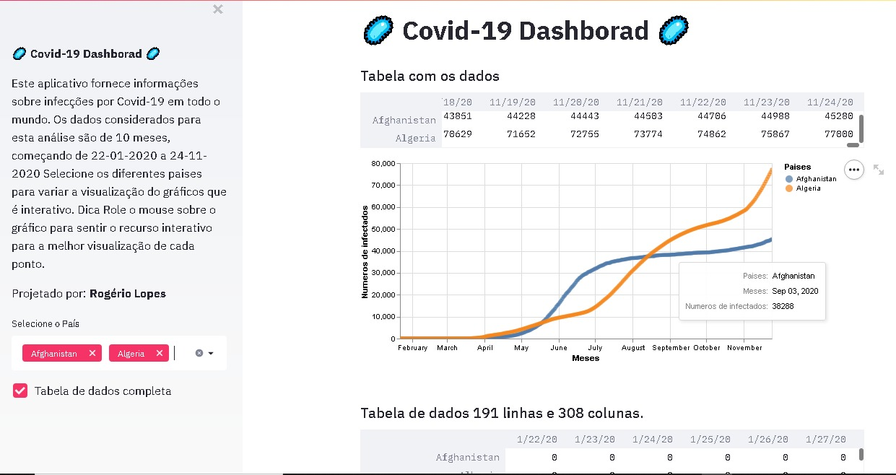
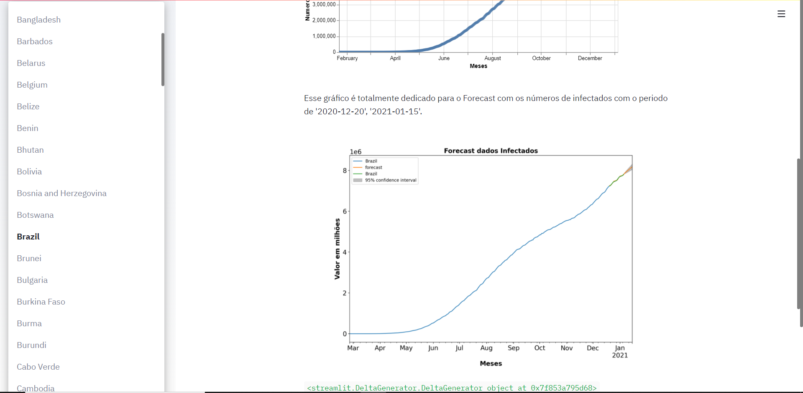

<p align="center"> 

</p>


# 🦠 Analise para o Covid-19 🦠

Xó covid, recentemente fiz uma analise com a aplicação utilizando o **Shiny** mas com outro foco, que foi trabalhar com o *yahoo finance* onde criei uma dash iterativa, que permitia o usuário colocar a sigla da ação desejada e era retornado pra ele o valor de venda e o volume de ações vendidas.

Seguindo essa mesma metodologia resolvi criar algo para o vírus que vem deixando o mundo de cabelos em pé não é mesmo?

Porém resolvi segui com uma outra liguagem de programação, e utilizei o **Python** juntamente com a biblioteca Streamlit, O **Streamlit** pode transformar scripts de dados em aplicativos da web compartilháveis ​​em minutos. Tudo em Python. Tudo de graça. E o melhor não é preciso ter nenhuma experiência com front-end. 

Para fazer a capturas dos dados que foram utilizar para realizar essa tarefa eu utilizei o Repositório de dados COVID-19 pelo Centro de Ciência e Engenharia de Sistemas (CSSE) da Universidade Johns Hopkins, esse repositório é atualizado com fraquencia com fonte de dados confiáveis do mundo todo.

**Link para ser direcionado para o repositório:**

[Clique aqui para olhar e entender melhor as fontes dos dados](https://github.com/CSSEGISandData/COVID-19)

Utilizei um recurso que pode transformar um arquivo **.ipynb** para **.py** se não terei que ficar utilizando duas ID's, no caso **pyCharm** e o **jupyternotebook** a baixo o script:

```python
!jupyter nbconvert   --to script YOURNOTEBOOKNAME.ipynb
!awk '!/ipython/' YOURNOTEBOOKNAME.py >  temp.py && mv temp.py app.py && rm YOURNOTEBOOKNAME.py
!streamlit YOURNOTEBOOKNAME app.py
```
**Link para entender um pouco mais sobre o script:**

[Clique aqui para saber mais](https://github.com/ChristianFJung/NotebookToWebApp/blob/master/article.md)

Também utilizei a ferramente **Heroku** para fazer o deploy e subir essa dash linda. Ela ficara disponível para o público.

**Link para dash linda 🦠**

[Clique aqui para ser direcionado](https://covid-mundial.herokuapp.com/)

A seguir um exemplo de como ficou na prática nossa dash:

<p align="center"> 

</p>

<p align="center"> 

</p>